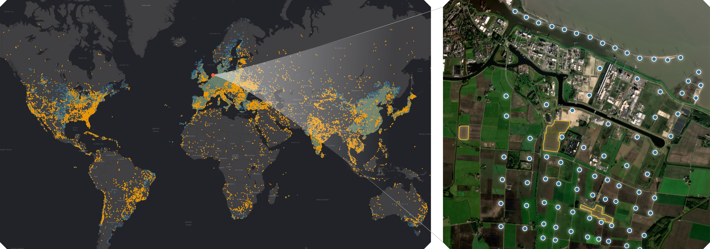

# Global Renewables Watch

We present a comprehensive global temporal dataset of commercial solar photovoltaic (PV) farms and onshore wind turbines, derived from high-resolution satellite imagery analyzed quarterly from the fourth quarter of 2017 to the second quarter of 2024. We create this dataset by training deep learning based segmentation models to identify these renewable energy installations from satellite imagery, then deploy them on over 13 trillion pixels covering the world. For each detected feature, we estimate the construction date and the preceding land use type. This dataset offers crucial insights into progress toward sustainable development goals and serves as a valuable resource for policymakers, researchers, and stakeholders aiming to assess and promote effective strategies for renewable energy deployment. Our final spatial dataset includes 375,197 individual wind turbines and 86,410 solar PV installations. We aggregate our predictions to the country level --- estimating total power capacity based on construction date, solar PV area, and number of windmills --- and find a R2 values of 0.96 and 0.93 for solar PV and onshore wind respectively compared to IRENA's most recent 2023 country level capacity estimates.

<p align="center">
    <br/>
    <b>Figure 1.</b> Global wind and solar dataset for 2024q2.
</p>


## Dataset Download

Download the complete dataset from the [release page](https://github.com/microsoft/global-renewables-watch/releases/tag/v1.0), or use direct links below:
- **Solar PV Dataset (2024 Q2):** [download](https://github.com/microsoft/global-renewables-watch/releases/download/v1.0/solar_all_2024q2_v1.gpkg)
- **Wind Turbine Dataset (2024 Q2):** [download](https://github.com/microsoft/global-renewables-watch/releases/download/v1.0/wind_all_2024q2_v1.gpkg)

The datasets are provided as GeoPackage (.gpkg) files containing global detections with construction dates and land use information.

## Model Inference

We provide two inference scripts: `inference_solar.py` for solar panel detection and `inference_wind.py` for wind turbine detection with the pretrained models. These each take a single GeoTIFF image as input and output a prediction GeoTIFF of the same shape.


### Setup

First, setup a conda environment using the provided `environment.yml` file:
```bash
conda env create -f environment.yml
conda activate grw
```

Then download the pre-trained models to the `models/` directory:
```bash
mkdir -p models
wget -O models/solar_model.ckpt https://github.com/microsoft/global-renewables-watch/releases/download/v1.1/solar_model.ckpt
wget -O models/wind_model.pth https://github.com/microsoft/global-renewables-watch/releases/download/v1.1/wind_model.pth
```

### Solar Panel Inference

Run the solar panel detection model on a single GeoTIFF image:

```bash
python inference_solar.py \
    --model-fn models/solar_model.ckpt \
    --input-fn data/example_image.tif \
    --output-dir results/ \
    --gpu 0 \
    --verbose
```

### Wind Turbine Inference

Run the wind turbine detection model on a single GeoTIFF image:

```bash
python inference_wind.py \
    --model-fn models/wind_model.pth \
    --input-fn data/example_image.tif \
    --output-dir results/ \
    --gpu 0 \
    --verbose
```

### Notes

- Solar inference expects 4096x4096 pixel images
- Wind inference can handle arbitrary image sizes using a sliding window approach
- Both scripts support skip/overwrite modes to avoid reprocessing existing outputs
- GPU is recommended for faster inference but not required
- Output files maintain the same geospatial reference as input files


## Citation

If you use this work, please consider citing our [paper](https://arxiv.org/abs/2503.14860):
```
@article{robinson2025global,
  title={Global Renewables Watch: A Temporal Dataset of Solar and Wind Energy Derived from Satellite Imagery},
  author={Robinson, Caleb and Ortiz, Anthony and Kim, Allen and Dodhia, Rahul and Zolli, Andrew and Nagaraju, Shivaprakash K and Oakleaf, James and Kiesecker, Joe and Ferres, Juan M Lavista},
  journal={arXiv preprint arXiv:2503.14860},
  year={2025}
}
```


## Contributing

This project welcomes contributions and suggestions.  Most contributions require you to agree to a
Contributor License Agreement (CLA) declaring that you have the right to, and actually do, grant us
the rights to use your contribution. For details, visit [Contributor License Agreements](https://cla.opensource.microsoft.com).

When you submit a pull request, a CLA bot will automatically determine whether you need to provide
a CLA and decorate the PR appropriately (e.g., status check, comment). Simply follow the instructions
provided by the bot. You will only need to do this once across all repos using our CLA.

This project has adopted the [Microsoft Open Source Code of Conduct](https://opensource.microsoft.com/codeofconduct/).
For more information see the [Code of Conduct FAQ](https://opensource.microsoft.com/codeofconduct/faq/) or
contact [opencode@microsoft.com](mailto:opencode@microsoft.com) with any additional questions or comments.

## Trademarks

This project may contain trademarks or logos for projects, products, or services. Authorized use of Microsoft
trademarks or logos is subject to and must follow
[Microsoft's Trademark & Brand Guidelines](https://www.microsoft.com/legal/intellectualproperty/trademarks/usage/general).
Use of Microsoft trademarks or logos in modified versions of this project must not cause confusion or imply Microsoft sponsorship.
Any use of third-party trademarks or logos are subject to those third-party's policies.
